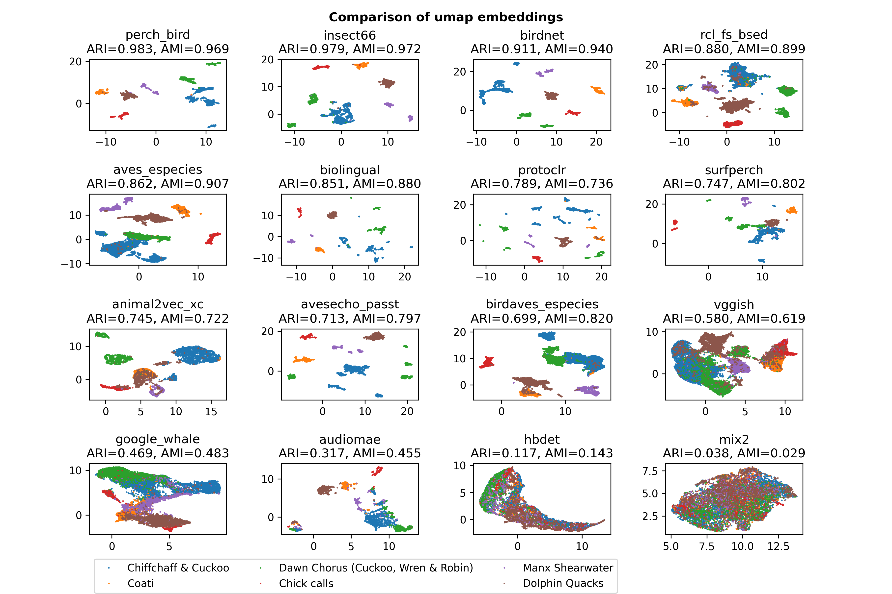

# bacpipe
BioAcoustic Collection Pipeline

This repository aims to streamline the generation and testing of embeddings using a large variety of bioacoustic models. 

The below image shows a comparison of umap embeddings based on 16 different bioacoustic models. The models are being evaluated on the DCASE Task 5 Few-Shot learning dataset. This repository is an attempt to enable a comparison of bioacoustic models based on their embedding spaces, rather than their classification results.

# Installation

### Create and activate your environment

Create a virtual environment using python3.11 or python3.10 and virtualenv
`python3.11 -m virtualenv env_bacpipe`

activate the environment

`source env_bacpipe/bin/activate`

### Ensure you have the following before installing the requirements.
- for `fairseq` to install you will need python headers:
`sudo apt-get install python3.11-dev`
- pip version 24.0 (`pip install pip==24.0`, omegaconf 2.0.6 has a non-standard dependency specifier PyYAML>=5.1.*. pip 24.1 will enforce this behaviour change and installation will thus fail.)

### Install the dependencies once the prerequisites are satisfied.

`pip install -r requirements.txt`

#### For Windows use the windows-specific requirements

`pip install -r requirements_windows.txt`

If you do not have admin rights and encounter a `permission denied` error when using `pip install`, use `python -m pip install ...` instead.

### Test the installation you can execute the test suite. 

By doing so you will also ensure that the directory structure for the model checkpoints will be created.

`python -m pytest -v bacpipe/tests/test_reducing_dimensions.py bacpipe/tests/test_embedding_creation.py`

Again, for windows in case of restricted permissions, use `python -m pytest -v --disable-warnings test_embedding_creation.py`.

### Add the model checkpoints that are not included by default.

Download the ones that are available from [here](https://github.com/bioacoustic-ai/bacpipe/tree/main/bacpipe/pipelines) and create directories corresponding to the pipeline-names and place the checkpoints within them. 

# Usage

Modify the [config.yaml](config.yaml) file in the root directory to specify the path to your `dataset`. Define what models to run by specifying the strings in the `embedding_model` list (copy and paste as needed). If you want to run a dimensionality reduction model, specify the name in the `dim_reduction_model` variable.

Once the configuration is complete, execute the run_pipeline.py file (make sure the environment is activated)
`python run_pipeline.py` .

While the scripts are executed, directories will be created in the `bacpipe/evaluation` directory. Embeddings will be saved in `bacpipe/evaluation/embeddings` (see [here](bacpipe/evaluation/embeddings/README.md) for more info) and if selected, reduced dimensionality embeddings will be saved in `bacpipe/evaluation/dim_reduced_embeddings` (see [here](bacpipe/evaluation/dim_reduced_embeddings/README.md) for more infor) . 

# Evaluation

Evaluation of the models is possible in different ways, which is all explained  [here](bacpipe/evaluation/README.md). 

# Available models

The models all have their model specific code to ensure inference runs smoothly. More info on the models and their pipelines can be found [here](bacpipe/pipelines/README.md).

Models currently include:

|   Name|   ref paper|   ref code|   sampling rate|   input length| embedding dimension |
|---|---|---|---|---|---|
|  Animal2vec_XC|   [paper](https://arxiv.org/abs/2406.01253)   |   [code](https://github.com/livingingroups/animal2vec)    |   24 kHz|   5 s| 768 |
|  Animal2vec_MK|   [paper](https://arxiv.org/abs/2406.01253)   |   [code](https://github.com/livingingroups/animal2vec)    |   8 kHz|   10 s| 1024 |
|   AudioMAE    |   [paper](https://proceedings.neurips.cc/paper_files/paper/2022/hash/b89d5e209990b19e33b418e14f323998-Abstract-Conference.html)   |   [code](https://github.com/facebookresearch/AudioMAE)    |   16 kHz|   10 s| 768 |
|   AVES_ESpecies        |   [paper](https://arxiv.org/abs/2210.14493)   |   [code](https://github.com/earthspecies/aves)    |   16 kHz|   1 s| 768 |
|   BioLingual  |   [paper](https://arxiv.org/abs/2308.04978)   |   [code](https://github.com/david-rx/biolingual)    |   48 kHz|   10 s| 512 |
|   BirdAVES_ESpecies    |   [paper](https://arxiv.org/abs/2210.14493)   |   [code](https://github.com/earthspecies/aves)    |   16 kHz|   1 s| 1024 |
|   BirdNET     |   [paper](https://www.sciencedirect.com/science/article/pii/S1574954121000273)   |   [code](https://github.com/kahst/BirdNET-Analyzer)    |   48 kHz|   3 s| 1024 |
|   AvesEcho_PASST   |   [paper](https://arxiv.org/abs/2409.15383)   |   [code](https://gitlab.com/arise-biodiversity/DSI/algorithms/avesecho-v1)    |   32 kHz|   3 s| 768 |
|   HumpbackNET |   [paper](https://pubs.aip.org/asa/jasa/article/155/3/2050/3271347)   |   [code](https://github.com/vskode/acodet)    |   2 kHz|   3.9124 s| 2048|
|   Insect66NET |   paper   |   [code](https://github.com/danstowell/insect_classifier_GDSC23_insecteffnet)    |   44.1 kHz|   5.5 s| 1280 |
|   Insect459NET |   paper   |   pending    |   44.1 kHz|   5.5 s| 1280 |
|   Mix2        |   [paper](https://arxiv.org/abs/2403.09598)   |   [code](https://github.com/ilyassmoummad/Mix2/tree/main)    |   16 kHz|   3 s| 960 |
|   Perch_Bird       |   [paper](https://www.nature.com/articles/s41598-023-49989-z.epdf)   |   [code](https://github.com/google-research/perch)    |   32 kHz|   5 s| 1280 |
|   ProtoCLR     |   [paper](https://arxiv.org/pdf/2409.08589)   |   [code](https://github.com/ilyassmoummad/ProtoCLR)    |   16 kHz|   6 s| 384 |
|   RCL_FS_BSED     |   [paper](https://arxiv.org/abs/2309.08971)   |   [code](https://github.com/ilyassmoummad/RCL_FS_BSED)    |   22.05 kHz|   0.2 s| 2048 |
|   SurfPerch       |   [paper](https://arxiv.org/abs/2404.16436)   |   [code](https://www.kaggle.com/models/google/surfperch)    |   32 kHz|   5 s| 1280 |
|   Google_Whale       |   paper   |   [code](https://www.kaggle.com/models/google/multispecies-whale/TensorFlow2/default/2)    |   24 kHz|   5 s| 1280 |
|   VGGish      |   [paper](https://ieeexplore.ieee.org/document/7952132)   |   [code](https://github.com/tensorflow/models/tree/master/research/audioset/vggish)    |   16 kHz|   0.96 s| 128 |

# Known issues

Given that this repository compiles a large number of very different deep learning models wich different requirements, some issues have been noted. 

Please raise issues if there are questions or bugs. 

Also, please cite the authors of the respective models, all models are referenced in the table above.