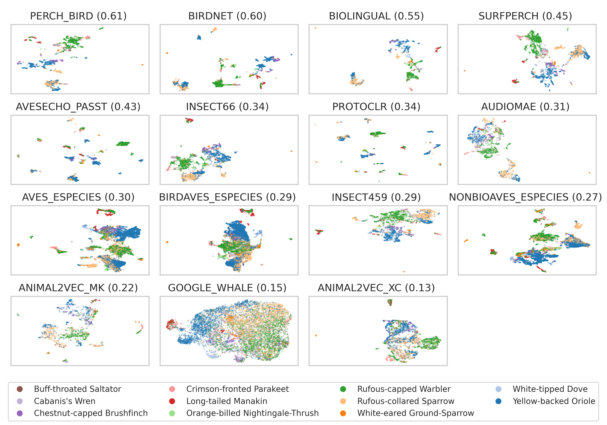

# bacpipe
### BioAcoustic Collection Pipeline

This repository aims to streamline the generation and evaluation of embeddings using a large variety of bioacoustic models.

The below image shows a comparison of umap embeddings based on 15 different bioacoustic models. The models are being evaluated on a bird and frog dataset (more details in [this conference paper](https://arxiv.org/abs/2504.06710)). This repository is an attempt to enable a comparison of bioacoustic models based on their embedding spaces, rather than their classification results.



The way the pipeline works is that it takes a dataset of audio files, runs them through a series of models, and generates embeddings. These embeddings can then be used for various tasks such as clustering, classification, or visualization.

By default the embeddings will be generated for the models specified in the `config.yaml` file. Once the embeddings are generated, 2d reduced embeddings will be created using the dimensionality reduction model specified in the `config.yaml` file. 

Furthermore, the embeddings can be evaluated using different metrics. The evaluation is done using the `evaluate.py` script, which takes the generated embeddings and computes various metrics such as clustering performance and classification performance. The evaluation results are saved in the `bacpipe/results/by_dataset` directory.

The repository also includes a panel dashboard for visualizing the generated embeddings. To enable the dashboard, simply set the `dashboard` variable to `True` in the `bacpipe/settings.yaml` file. The dashboard will be available at `http://localhost:8050` after running the `run_dashboard.py` script.

The pipeline is designed to be modular, so you can easily add or remove models as needed. The models are organized into pipelines, which are defined in the `bacpipe/pipelines` directory. 

# Installation

### Create and activate your environment

Create a virtual environment using python3.11 or python3.10 and virtualenv
`python3.11 -m virtualenv env_bacpipe`

activate the environment

`source env_bacpipe/bin/activate`

### Ensure you have the following before installing the requirements.
- for `fairseq` to install you will need python headers:
`sudo apt-get install python3.11-dev`
- pip version 24.0 (`pip install pip==24.0`, omegaconf 2.0.6 has a non-standard dependency specifier PyYAML>=5.1.*. pip 24.1 will enforce this behaviour change and installation will thus fail.)

### Install the dependencies once the prerequisites are satisfied.

`pip install -r requirements.txt`

#### For Windows use the windows-specific requirements

`pip install -r requirements_windows.txt`

If you do not have admin rights and encounter a `permission denied` error when using `pip install`, use `python -m pip install ...` instead.

### Add the model checkpoints that are not included by default.

Download the ones that are available from [here](https://github.com/bioacoustic-ai/bacpipe/tree/main/bacpipe/pipelines) and create directories corresponding to the pipeline-names and place the checkpoints within them. 

### To test the installation you can execute the test suite. 

By doing so you will also ensure that the directory structure for the model checkpoints will be created.

`python -m pytest -v --disable-warnings bacpipe/tests/*`

# Usage

## Model selection

The only two files that need to be modified are the `config.yaml` and `settings.yaml` files.

Modify the [config.yaml](config.yaml) file in the root directory to specify the path to your `dataset`. Define what models to run (from the `available_models`) by specifying the strings in the `selected_models` list (copy and paste as needed, I usually just comment the model's I don't want to run). 

If you have already computed embeddings and you want to do the dimensionality reduction and evaluation for the models you have already run, you can set the `already_computed` variable to `True`. This will only select the models that have already been computed.

In either case if you have already computed embeddings with a model, bacpipe will skip the model and use the already computed embeddings (if they are still located in the same directory).

## Dimensionality reduction

If you want to run a dimensionality reduction model, specify the name in the `dim_reduction_model` variable.

## Evaluation

Specify the evaluation tasks in the `evaluation_task` variable. The available tasks are `clustering` and `classification`. 

The evaluation results will be saved in the `bacpipe/results/by_dataset/evaluation` directory.

## Dashboard

If you want to run the dashboard, set the `dashboard` variable to `True` in the `settings.yaml` file. The dashboard will be available at `http://localhost:8050` after running the `run_dashboard.py` script.
The dashboard will show the embeddings for the selected models and the dimensionality reduction model. You can select the models you want to visualize in the dropdown menu.

## Running the pipeline

Once the configuration is complete, execute the run_pipeline.py file (make sure the environment is activated)
`python run_pipeline.py`

While the scripts are executed, directories will be created in the `bacpipe/results/by_dataset` directory. Embeddings will be saved in `bacpipe/results/by_dataset/YOUR_DATASET/embeddings` (see [here](bacpipe/evaluation/embeddings/README.md) for more info) and if selected, reduced dimensionality embeddings will be saved in `bacpipe/evaluation/dim_reduced_embeddings` (see [here](bacpipe/evaluation/dim_reduced_embeddings/README.md) for more infor) . 

# Available models

The models all have their model specific code to ensure inference runs smoothly. More info on the models and their pipelines can be found [here](bacpipe/pipelines/README.md).

Models currently include:

|   Name|   ref paper|   ref code|   sampling rate|   input length| embedding dimension |
|---|---|---|---|---|---|
|  Animal2vec_XC|   [paper](https://arxiv.org/abs/2406.01253)   |   [code](https://github.com/livingingroups/animal2vec)    |   24 kHz|   5 s| 768 |
|  Animal2vec_MK|   [paper](https://arxiv.org/abs/2406.01253)   |   [code](https://github.com/livingingroups/animal2vec)    |   8 kHz|   10 s| 1024 |
|   AudioMAE    |   [paper](https://proceedings.neurips.cc/paper_files/paper/2022/hash/b89d5e209990b19e33b418e14f323998-Abstract-Conference.html)   |   [code](https://github.com/facebookresearch/AudioMAE)    |   16 kHz|   10 s| 768 |
|   AVES_ESpecies        |   [paper](https://arxiv.org/abs/2210.14493)   |   [code](https://github.com/earthspecies/aves)    |   16 kHz|   1 s| 768 |
|   BioLingual  |   [paper](https://arxiv.org/abs/2308.04978)   |   [code](https://github.com/david-rx/biolingual)    |   48 kHz|   10 s| 512 |
|   BirdAVES_ESpecies    |   [paper](https://arxiv.org/abs/2210.14493)   |   [code](https://github.com/earthspecies/aves)    |   16 kHz|   1 s| 1024 |
|   NonBioAVES_ESpecies    |   [paper](https://arxiv.org/abs/2210.14493)   |   [code](https://github.com/earthspecies/aves)    |   16 kHz|   1 s| 768 |
|   BirdNET     |   [paper](https://www.sciencedirect.com/science/article/pii/S1574954121000273)   |   [code](https://github.com/kahst/BirdNET-Analyzer)    |   48 kHz|   3 s| 1024 |
|   AvesEcho_PASST   |   [paper](https://arxiv.org/abs/2409.15383)   |   [code](https://gitlab.com/arise-biodiversity/DSI/algorithms/avesecho-v1)    |   32 kHz|   3 s| 768 |
|   HumpbackNET |   [paper](https://pubs.aip.org/asa/jasa/article/155/3/2050/3271347)   |   [code](https://github.com/vskode/acodet)    |   2 kHz|   3.9124 s| 2048|
|   Insect66NET |   [paper](https://doi.org/10.1371/journal.pcbi.1011541)   |   [code](https://github.com/danstowell/insect_classifier_GDSC23_insecteffnet)    |   44.1 kHz|   5.5 s| 1280 |
|   Insect459NET |   [paper](https://arxiv.org/pdf/2503.15074)   |   pending    |   44.1 kHz|   5.5 s| 1280 |
|   Mix2        |   [paper](https://arxiv.org/abs/2403.09598)   |   [code](https://github.com/ilyassmoummad/Mix2/tree/main)    |   16 kHz|   3 s| 960 |
|   Perch_Bird       |   [paper](https://www.nature.com/articles/s41598-023-49989-z.epdf)   |   [code](https://github.com/google-research/perch)    |   32 kHz|   5 s| 1280 |
|   ProtoCLR     |   [paper](https://arxiv.org/pdf/2409.08589)   |   [code](https://github.com/ilyassmoummad/ProtoCLR)    |   16 kHz|   6 s| 384 |
|   RCL_FS_BSED     |   [paper](https://arxiv.org/abs/2309.08971)   |   [code](https://github.com/ilyassmoummad/RCL_FS_BSED)    |   22.05 kHz|   0.2 s| 2048 |
|   SurfPerch       |   [paper](https://arxiv.org/abs/2404.16436)   |   [code](https://www.kaggle.com/models/google/surfperch)    |   32 kHz|   5 s| 1280 |
|   Google_Whale       |   paper   |   [code](https://www.kaggle.com/models/google/multispecies-whale/TensorFlow2/default/2)    |   24 kHz|   5 s| 1280 |
|   VGGish      |   [paper](https://ieeexplore.ieee.org/document/7952132)   |   [code](https://github.com/tensorflow/models/tree/master/research/audioset/vggish)    |   16 kHz|   0.96 s| 128 |


# Known issues

Given that this repository compiles a large number of very different deep learning models wich different requirements, some issues have been noted. 

Please raise issues if there are questions or bugs. 

Also, please cite the authors of the respective models, all models are referenced in the table above.


# Citation

This work is first described in a conference paper. If you use bacpipe for your research, please include the following reference:

```bibtex
@misc{kather2025clusteringnovelclassrecognition,
      title={Clustering and novel class recognition: evaluating bioacoustic deep learning feature extractors}, 
      author={Vincent S. Kather and Burooj Ghani and Dan Stowell},
      year={2025},
      eprint={2504.06710},
      archivePrefix={arXiv},
      primaryClass={cs.LG},
      url={https://arxiv.org/abs/2504.06710}, 
}
```


