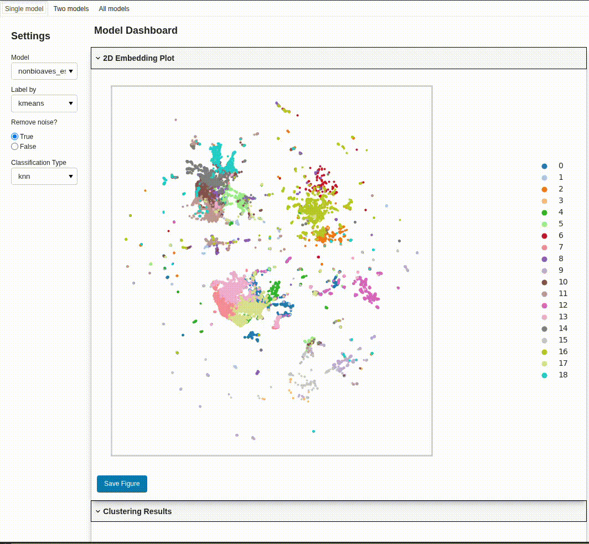

# Welcome to **bacpipe** (**B**io**A**coustic **C**ollection **Pipe**line)

### This repository aims to streamline the generation and evaluation of embeddings using a large variety of bioacoustic models.

The below image shows a comparison of umap embeddings based on 15 different bioacoustic models. The models are being evaluated on a bird and frog dataset (more details in [this conference paper](https://arxiv.org/abs/2504.06710)). This repository is an attempt to enable a comparison of bioacoustic models based on their embedding spaces, rather than their classification results.


## 📚 Table of Contents

- [How it works](#how-it-works)
- [Dashboard visualization](#dashboard-visualization)
- [Installation](#installation)
- [Usage](#usage)
  - [Model selection](#model-selection)
  - [Dimensionality reduction](#dimensionality-reduction)
  - [Evaluation](#evaluation)
  - [Dashboard](#dashboard)
  - [Running the pipeline](#running-the-pipeline)
- [Available models](#available-models)
- [Contribute](#contribute)
- [Known issues](#known-issues)
- [Citation](#citation)


---
<!-- <details> -->
<!-- <summary><b style="font-size: 2em;">How it works</b></summary> -->
# How it works

**bacpipe** requires a dataset of audio files, runs them through a series of models, and generates embeddings. These embeddings can then be used visualized and evaluated for various tasks such as clustering or classification.

By default the embeddings will be generated for the models specified in the [config.yaml](config.yaml) file. 

Currently these bioacoustic models are supported (more details below):
```yaml

available_models : [
    "animal2vec_xc",
    "animal2vec_mk",
    "audiomae",
    "aves_especies",
    "biolingual",
    "birdaves_especies",
    "birdnet",
    "avesecho_passt",
    "hbdet",
    "insect66",
    "insect459",
    "perch_bird",
    "mix2",
    "protoclr",
    "rcl_fs_bsed",
    "surfperch",
    "google_whale",
    "vggish",
  ]
```
Once the embeddings are generated, 2d reduced embeddings will be created using the dimensionality reduction model specified in the [config.yaml](config.yaml) file. 
And these dimensionality reduction models are supported:

```yaml
available_reduction_models: [
  "pca",
  "sparse_pca",
  "t_sne",
  "umap"
]
```

Furthermore, the embeddings can be evaluated using different metrics. The evaluation is done using the `evaluate.py` script, which takes the generated embeddings and computes various metrics such as clustering performance and classification performance. The evaluation results are saved in the `bacpipe/results` directory.

```yaml

available_evaluation_tasks: [
  "classification",
  "clustering"
]
```


The repository also includes a panel dashboard for visualizing the generated embeddings. To enable the dashboard, simply set the `dashboard` variable to `True` in the [settings.yaml](bacpipe/settings.yaml) file. The dashboard will automatically open in your browser (at `http://localhost:8050`) after running the `run_dashboard.py` script.

The pipeline is designed to be modular, so you can easily add or remove models as needed. The models are organized into pipelines, which are defined in the `bacpipe/embedding_generation_pipelines/feature_extractors` directory. If you want to add a different dimensionality reduction model, you do so by adding new pipeline to the `bacpipe/embedding_generation_pipelines/dimensionality_reduction` directory.

## Using annotations for evaluation

If you have annotations for your dataset, you can use them to evaluate the generated embeddings. The labels will be used to compute the clustering and classification performance of the embeddings. 

To use the annotations for evaluation, create a file called `annotations.csv` in the directory specified in the `audio_dir` variable in the [config.yaml](config.yaml) file. The file should contain the following columns:
```csv
audiofilename,start,end,label
```
Where `audiofilename` is the name of the audio file, `start` and `end` are the start and end times of the annotation in seconds, and `label` is the label of the annotation.

For reference see the [example annotations file](bacpipe/tests/test_data/annotations.csv).

If this file exists, the evaluation script will automatically use the annotations to compute the clustering and classification performance of the embeddings. The labels will also be used to color the points in the dashboard visualization showing the embeddings.


# Dashboard visualization

### bacpipe includes a dashboard visualization by default allowing you to easily explore the generated embeddings

Once embeddings are generated, they can be easily visualized using a dashboard (built using `panel`) by simply setting the `dashboard` setting in the [config.yaml](config.yaml) file to `True`.

Below you can see a gif showing the basic usage of the dashboard.



The dashboard has 3 main sections:
1. Single model
2. Two models
3. All models

In the single model section, you can select a model and visualize the embeddings generated by that model. The embeddings can be colored by :
- metadata extracted from the files (date and time information, and file and parent directory) 
- the labels specified in the `annotations.csv` file
- the cluster labels generated by the clustering algorithm (kmeans)

In the dashboard sidebar you can select the model, by which to label the embeddings, whether to remove noise, and the type of classification task to show the results for. 

The noise removal is done by removing the embeddings that do not correspond to annotated sections of the audio files. This is useful if you want to focus on the annotated sections of the audio files and disregard the rest of the data. 

The visualizations can be saved as png files by clicking the save button in the bottom right corner of the plot.

Try it out and feel free to give feedback or raise issues if you have any questions or suggestions for improvements.


---
<details>
<summary><b style="font-size: 2em;">Installation</b></summary>


### Create and activate your environment

Create a virtual environment using python3.11 or python3.10 and virtualenv
`python3.11 -m virtualenv env_bacpipe`

(for windows use `/c/$USERNAME/AppData/Local/Programs/Python/Python311/python.exe -m virtualenv env_bacpipe`)

activate the environment

`source env_bacpipe/bin/activate` (for windows use `env_bacpipe\Scripts\activate`)

### Clone the repository
`git clone https://github.com/bioacoustic-ai/bacpipe.git`

### Ensure you have the following before installing the requirements.
- for `fairseq` to install you will need python headers:
`sudo apt-get install python3.11-dev`
- pip version 24.0 (`pip install pip==24.0`, omegaconf 2.0.6 has a non-standard dependency specifier PyYAML>=5.1.*. pip 24.1 will enforce this behaviour change and installation will thus fail.)

### Install the dependencies once the prerequisites are satisfied.

`pip install -r requirements.txt`

#### For Windows use the windows-specific requirements

`pip install -r requirements_windows.txt` (windows does no support `fairseq` and will therefore not be able to run the `animal2vec` models)

If you do not have admin rights and encounter a `permission denied` error when using `pip install`, use `python -m pip install ...` instead.

### Add the model checkpoints that are not included by default.

Download the ones that are available from [here](https://github.com/bioacoustic-ai/bacpipe/tree/main/bacpipe/pipelines) and create directories corresponding to the pipeline-names and place the checkpoints within them. 

### To test the installation you can execute the test suite. 

By doing so you will also ensure that the directory structure for the model checkpoints will be created.

`pytest -v --disable-warnings bacpipe/tests/test_embedding_creation.py`

</details>

---

# Usage

## Configurations and settings

The only two files that need to be modified are the [config.yaml](config.yaml) and [settings.yaml](bacpipe/settings.yaml) files. The [config.yaml](config.yaml) is used for the standard configurations: 
- path to audio files
- models to run
- dimensionality reduction model
- evaluation tasks
- whether to run the dashboard or not

The [settings.yaml](bacpipe/settings.yaml) file is used for more advanced configurations and does not need to be modified unless you have specific preferences. It includes settings such as to run on a `cpu` or a `gpu` (by default `cpu`), the paths where results are saved, configurations for the evaluation tasks and more. 

Modify the [config.yaml](config.yaml) file in the root directory to specify the path to your `dataset`. Define what models to run (from the `available_models`) by specifying the strings in the `selected_models` list (copy and paste as needed, I usually just comment the model's I don't want to run). 

If you have already computed embeddings and you want to do the dimensionality reduction and evaluation for the models you have already run, you can set the `already_computed` variable to `True`. This will only select the models that have already been computed.

In either case if you have already computed embeddings with a model, **bacpipe** will skip the model and use the **already computed** embeddings (if they are still located in the same directory). Even if `overwrite` is set to `True`, **bacpipe** will not overwrite the embeddings if they already exist. 

## Running the pipeline

Once the configuration is complete, execute the run_pipeline.py file (make sure the environment is activated)
`python run_pipeline.py`

While the scripts are executed, directories will be created in the `bacpipe/results` directory. Embeddings will be saved in `bacpipe/results/YOUR_DATASET/embeddings` (see [here](results/test_data/embeddings/README.md) for more info) and if selected, reduced dimensionality embeddings will be saved in `bacpipe/evaluation/dim_reduced_embeddings` (see [here](results/test_data/dim_reduced_embeddings/README.md) for more infor) . 

# Available models

The models all have their model specific code to ensure inference runs smoothly. More info on the models and their pipelines can be found [here](bacpipe/pipelines/README.md).

Models currently include:

|   Name|   ref paper|   ref code|   sampling rate|   input length| embedding dimension |
|---|---|---|---|---|---|
|  Animal2vec_XC|   [paper](https://arxiv.org/abs/2406.01253)   |   [code](https://github.com/livingingroups/animal2vec)    |   24 kHz|   5 s| 768 |
|  Animal2vec_MK|   [paper](https://arxiv.org/abs/2406.01253)   |   [code](https://github.com/livingingroups/animal2vec)    |   8 kHz|   10 s| 1024 |
|   AudioMAE    |   [paper](https://proceedings.neurips.cc/paper_files/paper/2022/hash/b89d5e209990b19e33b418e14f323998-Abstract-Conference.html)   |   [code](https://github.com/facebookresearch/AudioMAE)    |   16 kHz|   10 s| 768 |
|   AVES_ESpecies        |   [paper](https://arxiv.org/abs/2210.14493)   |   [code](https://github.com/earthspecies/aves)    |   16 kHz|   1 s| 768 |
|   BioLingual  |   [paper](https://arxiv.org/abs/2308.04978)   |   [code](https://github.com/david-rx/biolingual)    |   48 kHz|   10 s| 512 |
|   BirdAVES_ESpecies    |   [paper](https://arxiv.org/abs/2210.14493)   |   [code](https://github.com/earthspecies/aves)    |   16 kHz|   1 s| 1024 |
|   NonBioAVES_ESpecies    |   [paper](https://arxiv.org/abs/2210.14493)   |   [code](https://github.com/earthspecies/aves)    |   16 kHz|   1 s| 768 |
|   BirdNET     |   [paper](https://www.sciencedirect.com/science/article/pii/S1574954121000273)   |   [code](https://github.com/kahst/BirdNET-Analyzer)    |   48 kHz|   3 s| 1024 |
|   AvesEcho_PASST   |   [paper](https://arxiv.org/abs/2409.15383)   |   [code](https://gitlab.com/arise-biodiversity/DSI/algorithms/avesecho-v1)    |   32 kHz|   3 s| 768 |
|   HumpbackNET |   [paper](https://pubs.aip.org/asa/jasa/article/155/3/2050/3271347)   |   [code](https://github.com/vskode/acodet)    |   2 kHz|   3.9124 s| 2048|
|   Insect66NET |   [paper](https://doi.org/10.1371/journal.pcbi.1011541)   |   [code](https://github.com/danstowell/insect_classifier_GDSC23_insecteffnet)    |   44.1 kHz|   5.5 s| 1280 |
|   Insect459NET |   [paper](https://arxiv.org/pdf/2503.15074)   |   pending    |   44.1 kHz|   5.5 s| 1280 |
|   Mix2        |   [paper](https://arxiv.org/abs/2403.09598)   |   [code](https://github.com/ilyassmoummad/Mix2/tree/main)    |   16 kHz|   3 s| 960 |
|   Perch_Bird       |   [paper](https://www.nature.com/articles/s41598-023-49989-z.epdf)   |   [code](https://github.com/google-research/perch)    |   32 kHz|   5 s| 1280 |
|   ProtoCLR     |   [paper](https://arxiv.org/pdf/2409.08589)   |   [code](https://github.com/ilyassmoummad/ProtoCLR)    |   16 kHz|   6 s| 384 |
|   RCL_FS_BSED     |   [paper](https://arxiv.org/abs/2309.08971)   |   [code](https://github.com/ilyassmoummad/RCL_FS_BSED)    |   22.05 kHz|   0.2 s| 2048 |
|   SurfPerch       |   [paper](https://arxiv.org/abs/2404.16436)   |   [code](https://www.kaggle.com/models/google/surfperch)    |   32 kHz|   5 s| 1280 |
|   Google_Whale       |   paper   |   [code](https://www.kaggle.com/models/google/multispecies-whale/TensorFlow2/default/2)    |   24 kHz|   5 s| 1280 |
|   VGGish      |   [paper](https://ieeexplore.ieee.org/document/7952132)   |   [code](https://github.com/tensorflow/models/tree/master/research/audioset/vggish)    |   16 kHz|   0.96 s| 128 |

<details>
<summary>Click to see more details on the models</summary>


|   Name|   paper|   code|   training|   CNN/Trafo| architecture | checkpoint link |
|---|---|---|---|---|---|---|
|  [Animal2vec_XC](#animal2vec_xc)|   [paper](https://arxiv.org/abs/2406.01253)   |   [code](https://github.com/livingingroups/animal2vec)    |   ssl + ft|   trafo | d2v2.0 | release pending |
|  [Animal2vec_MK](#animal2vec_mk) |   [paper](https://arxiv.org/abs/2406.01253)   |   [code](https://github.com/livingingroups/animal2vec)    |   ssl + ft|   trafo | d2v2.0 | [weights](https://edmond.mpg.de/dataset.xhtml?persistentId=doi:10.17617/3.ETPUKU)|
|   [AudioMAE](#audiomae)    |   [paper](https://proceedings.neurips.cc/paper_files/paper/2022/hash/b89d5e209990b19e33b418e14f323998-Abstract-Conference.html)   |   [code](https://github.com/facebookresearch/AudioMAE)    | ssl + ft|   trafo| ViT | [weights](https://drive.google.com/file/d/18EsFOyZYvBYHkJ7_n7JFFWbj6crz01gq/view)|
|   [AVES_ESpecies](#aves_especies)        |   [paper](https://arxiv.org/abs/2210.14493)   |   [code](https://github.com/earthspecies/aves)    |   ssl|   trafo | HuBERT | [weights](https://storage.googleapis.com/esp-public-files/ported_aves/aves-base-all.torchaudio.pt)|
|   [BioLingual](#biolingual)  |   [paper](https://arxiv.org/abs/2308.04978)   |   [code](https://github.com/david-rx/biolingual)    |   ssl|   trafo| CLAP | included |
|   [BirdAVES_ESpecies](#birdaves_especies)    |   [paper](https://arxiv.org/abs/2210.14493)   |   [code](https://github.com/earthspecies/aves)    |   ssl|   trafo | HuBERT | [weights](https://storage.googleapis.com/esp-public-files/birdaves/birdaves-bioxn-large.torchaudio.pt)|
|   [BirdNET](#birdnet)     |   [paper](https://www.sciencedirect.com/science/article/pii/S1574954121000273)   |   [code](https://github.com/kahst/BirdNET-Analyzer)    |   sup l|   CNN | EffNetB0 | [weights](https://github.com/kahst/BirdNET-Analyzer/tree/main/birdnet_analyzer/checkpoints/V2.4/BirdNET_GLOBAL_6K_V2.4_Model)|
|   [AvesEcho_PaSST](#avesecho_passt)   |   [paper](https://arxiv.org/abs/2409.15383)   |   [code](https://gitlab.com/arise-biodiversity/DSI/algorithms/avesecho-v1)    |   sup l |   trafo | PaSST | [weights](https://gitlab.com/arise-biodiversity/DSI/algorithms/avesecho-v1/-/blob/main/checkpoints/best_model_passt.pt?ref_type=heads) |
|   [HumpbackNET](#humpbacknet) |   [paper](https://pubs.aip.org/asa/jasa/article/155/3/2050/3271347)   |   [code](https://github.com/vskode/acodet)    |   sup l |   CNN | ResNet50| [weights](https://github.com/vskode/acodet/blob/main/acodet/src/models/Humpback_20221130.zip)|
|   [Insect66NET](#insect66net) |   paper   |   [code](https://github.com/danstowell/insect_classifier_GDSC23_insecteffnet)    |   sup l|   CNN | EffNetv2s | [weights](https://gitlab.com/arise-biodiversity/DSI/algorithms/cricket-cicada-detector-capgemini/-/blob/main/src/model_traced.pt?ref_type=heads)|
|   [Insect459NET](#insect459net) |   paper   |   pending    |   sup l|   CNN | EffNetv2s | pending |
|   [Mix2](#mix2)        |   [paper](https://arxiv.org/abs/2403.09598)   |   [code](https://github.com/ilyassmoummad/Mix2/tree/main)    |   sup l|   CNN| MobNetv3 | release pending|
|   [Perch_Bird](#perch_bird)       |   [paper](https://www.nature.com/articles/s41598-023-49989-z.epdf)   |   [code](https://github.com/google-research/perch)    |   sup l|   CNN| EffNetb0 | included |
|   [ProtoCLR](#protoclr)     |   [paper](https://arxiv.org/pdf/2409.08589)   |   [code](https://github.com/ilyassmoummad/ProtoCLR)    |   sup cl|   trafo| CvT-13 | [weights](https://huggingface.co/ilyassmoummad/ProtoCLR)|
|   [RCL_FS_BSED](#rcl_fs_bsed)     |   [paper](https://arxiv.org/abs/2309.08971)   |   [code](https://github.com/ilyassmoummad/RCL_FS_BSED)    |   sup cl|   CNN| ResNet9 | [weights](https://zenodo.org/records/11353694)|
|   [SurfPerch](#surfperch)       |   [paper](https://arxiv.org/abs/2404.16436)   |   [code](https://www.kaggle.com/models/google/surfperch)    |   sup l|   CNN| EffNetb0 | included |
|   [Google_Whale](#google_whale)       |   paper   |   [code](https://www.kaggle.com/models/google/multispecies-whale/TensorFlow2/default/2)    |   sup l|   CNN| EffNetb0 | included|
|   [VGGish](#vggish)      |   [paper](https://ieeexplore.ieee.org/document/7952132)   |   [code](https://github.com/tensorflow/models/tree/master/research/audioset/vggish)    |   sup l|   CNN| VGG | [weights](https://storage.googleapis.com/audioset/vggish_model.ckpt)|

## Brief description of models
All information is extracted from the respective repositories and manuscripts. Please refer to them for more details

### Animal2vec_XC
- raw waveform input
- self-supervised model
- transformer
- trained on bird song data

animal2vec model weights are from self-supervised pretraining on xeno-canto data. The model is based on data2vec2.0 with a number of bioacoustic-specific model implementations. See paper for more details.

### Animal2vec_MK 
- raw waveform input
- self-supervised pretrained model, fine-tuned
- transformer
- trained on meerkat vocalizations

animal2vec model weights are from self-supervised pretraining on meerkat data with fine tuning on a curated meerkat dataset. The model is based on data2vec2.0 with a number of bioacoustic-specific model implementations. See paper for more details.

### AudioMAE
- spectrogram input
- self-supervised pretrained model, fine-tuned
- vision transformer
- trained on general audio

AudioMAE from the facebook research group is a vision transformer pretrained on AudioSet-2M data and fine-tuned on AudioSet-20K.

### AVES_ESpecies
- transformer
- self-supervised pretrained model
- trained on general audio

AVES_ESpecies is short for Animal Vocalization Encoder based on Self-Supervision by the Earth Species Project. The model is based on the HuBERT-base architecture. The model is pretrained on unannotated audio datasets AudioSet-20K, FSD50K and the animal sounds from AudioSet and VGGSound.


### BioLingual
- transformer
- spectrogram input
- contrastive-learning
- self-supervised pretrained model
- trained on animal sound data (primarily bird song)

BioLingual is a language-audio model trained on captioning bioacoustic datasets inlcuding xeno-canto and iNaturalist. The model architecture is based on the [CLAP](https://arxiv.org/pdf/2211.06687) model architecture. 

### BirdAVES_ESpecies
- transformer
- self-supervised pretrained model
- trained on general audio and bird song data

BirdAVES_ESpecies is short for Bird Animal Vocalization Encoder based on Self-Supervision by the Earth Species Project. The model is based on the HuBERT-large architecture. The model is pretrained on unannotated audio datasets AudioSet-20K, FSD50K and the animal sounds from AudioSet and VGGSound as well as bird vocalizations from xeno-canto. 

### BirdNET
- CNN
- supervised training model
- trained on bird song data

BirdNET (v2.4) is based on a EfficientNET(b0) architecture. The model is trained on a large amount of bird vocalizations from the xeno-canto database alongside other bird song databses. 

### AvesEcho_PaSST
- transformer
- supervised pretrained model, fine-tuned
- pretrained on general audio and bird song data

AvesEcho_PaSST is a vision transformer trained on AudioSet and (deep) fine-tuned on xeno-canto. The model is based on the [PaSST](https://github.com/kkoutini/PaSST) framework. 


### HumpbackNET
- CNN
- supervised training model
- trained on humpback whale song

HumpbackNET is a binary classifier based on a ResNet-50 model trained on humpback whale data from different parts in the North Atlantic. 

### Insect66NET
- CNN
- supervised training model
- trained on insect sounds

InsectNET66 is a [EfficientNet v2 s](https://pytorch.org/vision/main/models/generated/torchvision.models.efficientnet_v2_s.html) model trained on the [Insect66 dataset](https://zenodo.org/records/8252141) including sounds of grasshoppers, crickets, cicadas developed by the winning team of the Capgemini Global Data Science Challenge 2023.

### Insect459NET
- CNN
- supervised training model
- trained on insect sounds

InsectNET459 is a [EfficientNet v2 s](https://pytorch.org/vision/main/models/generated/torchvision.models.efficientnet_v2_s.html) model trained on the Insect459 dataset (publication pending).


### Mix2
- CNN
- supervised training model
- trained on frog sounds

Mix2 is a [MobileNet v3](https://github.com/pytorch/vision/blob/main/torchvision/models/mobilenetv3.py) model trained on the [AnuranSet](https://github.com/soundclim/anuraset) which includes sounds of 42 different species of frogs from different regions in Brazil. The model was trained using a mixture of Mixup augmentations to handle the class imbalance of the data.

### RCL_FS_BSED
- CNN
- supervised contrastive learning
- trained on dcase 2023 task 5 dataset [link](https://zenodo.org/records/6482837)

RCL_FS_BSED stands for Regularized Contrastive Learning for Few-shot Bioacoustic Sound Event Detection and features a model based on a ResNet model. The model was originally created for the DCASE bioacoustic few shot challenge (task 5) and later improved.

### ProtoCLR
- transformer
- supervised contrastive learning
- trained on bird song data

ProtoCLR stands for Prototypical Contrastive Learning for robust representation learning. The architecture is a CvT-13 (Convolutional vision transformer) with 20M parameters. ProtoCLR has been validated on transfer learning tasks for bird sound classification, showing strong domain-invariance in few-shot scenarios. The model was trained on the xeno-canto dataset.


### Perch_Bird
- CNN
- supervised training model
- trained on bird song data

Perch_Bird is a EFficientNet B1 model trained on the entire Xeno-canto database.

### SurfPerch
- CNN
- supervised training model
- trained on bird song, fine-tuned on tropical reef data

Perch is a EFficientNet B1 model trained on the entire Xeno-canto database and fine tuned on coral reef and unrelated sounds.

### Google_Whale
- CNN
- supervised training model
- trained on 7 whale species

Google_Whale (multispecies_whale) is a EFficientNet B0 model trained on whale vocalizations and other marine sounds.


### VGGISH
- CNN
- supervised training model
- trained on general audio

VGGish is a model based on the [VGG](https://arxiv.org/pdf/1409.1556) architecture. The model is trained on audio from youtube videos (YouTube-8M)

# Dimensionality reduction models

To evaluate the generated embeddings a number of dimensionality reduction models are included in this repository:


|   name| reference|code reference   | linear |
|---|---|---|---|
|   UMAP        |   [paper](https://arxiv.org/abs/1802.03426)   |   [code](https://github.com/lmcinnes/umap)    |   No |
|   t-SNE        |   [paper](https://www.jmlr.org/papers/volume9/vandermaaten08a/vandermaaten08a.pdf?fbcl)   |   [code](https://scikit-learn.org/stable/modules/generated/sklearn.manifold.TSNE.html)    |   No |
|   PCA        |   [paper](http://www.cs.columbia.edu/~blei/fogm/2020F/readings/LeeSeung1999.pdf)   |   [code](https://scikit-learn.org/dev/modules/generated/sklearn.decomposition.PCA.html)    |   Yes |
|   Sparse_PCA        |   [paper](http://www.cs.columbia.edu/~blei/fogm/2020F/readings/LeeSeung1999.pdf)   |   [code](https://scikit-learn.org/dev/modules/generated/sklearn.decomposition.SparsePCA.html)    |   Yes |


</details>

---

<details>
<summary><b style="font-size: 2em;">Add a new model</b></summary>

To add a new model, simply add a pipeline with the name of your model. Make sure your model follows the following criteria:

- define the model specific __sampling rate__
- define the model specific input __segment length__
- define a class called "__Model__" which inherits the __ModelBaseClass__ from __bacpipe.utils__
- define the __init__, preproc, and __call__ methods so that the model can be called
- if necessary save the checkpoint in the __bacpipe.model_checkpoints__ dir with the name corresponding to the name of the model
- if you need to import code where your specific model class is defined, create a directory in __bacpipe.model_specific_utils__ corresponding to your model name "newmodel" and add all the necessary code in there

Here is an example:

```python 
import torch
from bacpipe.model_specific_utils.newmodel.module import MyClass

SAMPLE_RATE = 12345
LENGTH_IN_SAMPLES = int(10 * SAMPLE_RATE)

from ..utils import ModelBaseClass

class Model(ModelBaseClass):
    def __init__(self):
        super().__init__(sr=SAMPLE_RATE, segment_length=LENGTH_IN_SAMPLES)
        self.model = MyClass()
        state_dict = torch.load(
            self.model_base_path + "/newmodel/checkpoint_path.pth",
            weights_only=True,
        )
        self.model.load_state_dict(state_dict)

    def preprocess(self, audio): # audio is a torch.tensor object
        # insert your preprocessing steps
        return processed_audio

    def __call__(self, x):
        # by default the model will be called with .eval() mode
        return self.model(x)

```

Most of the models are based on pytorch. For tensorflow models, see __birdnet__, __hbdet__ or __vggish__.

</details>

---

# Contribute

This repository is intended to be a collaborative project for people working in the field of bioacoustics. If you think there is some improvement that could be useful, please raise an **issues**, submit a **PR** or get in touch. 

There are two main intentions for this repository that should always be considered when contributing: 
      
      1. Only add new requirements if truly necessary

Given the large number of different models, there are already a lot of requirements. To ensure that the repository is stable, and installation errors are kept minimal, please only add code with new requirements if truly necessary.
      
      2. The main purpose of bacpipe is quickly generating embeddings from models
      
There should always be a baseline minimal use case, where embeddings are created from different feature extractors and everything else is an add-on.

# Known issues

Given that this repository compiles a large number of very different deep learning models with different requirements, some issues have been noted. 

Please raise issues if there are questions or bugs. 

# Citation

A lot of work has gone into creating these bioacoustic models, both by data collectors and by machine learning practitioners, please cite the authors of the respective models (all models are referenced in the table above).


This work is first described in a conference paper. If you use **bacpipe** for your research, please include the following reference:

```bibtex
@misc{kather2025clusteringnovelclassrecognition,
      title={Clustering and novel class recognition: evaluating bioacoustic deep learning feature extractors}, 
      author={Vincent S. Kather and Burooj Ghani and Dan Stowell},
      year={2025},
      eprint={2504.06710},
      archivePrefix={arXiv},
      primaryClass={cs.LG},
      url={https://arxiv.org/abs/2504.06710}, 
}
```


